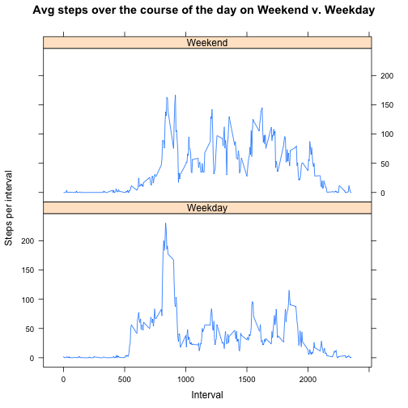

# Reproducible Research: Peer Assessment 1


## Loading and preprocessing the data

```r
setwd("~/Documents/Programming/DataSci/coursera series/reproducibleresearch/RepData_PeerAssessment1")
if(!file.exists("activity.csv")) {
	unzip("activity.zip")
}
act <- read.csv("activity.csv")
head(act)
```

```
##   steps       date interval
## 1    NA 2012-10-01        0
## 2    NA 2012-10-01        5
## 3    NA 2012-10-01       10
## 4    NA 2012-10-01       15
## 5    NA 2012-10-01       20
## 6    NA 2012-10-01       25
```

```r
class(act$date)
```

```
## [1] "factor"
```

```r
act$date <- as.Date(act$date)
```

## What is mean total number of steps taken per day?
Here, we add up the steps taken each day. First, we plot steps per day in a 
histogram with ten bins, to give a bit of detail on the distribution.


```r
daily_steps <- tapply(act$steps, act$date, sum, na.rm=T)
hist(daily_steps, breaks=10, col="blue", main="Histogram of Number of Daily Steps", xlab="Steps per Day")
```

 

Next, we take the mean and median of the total number of steps taken per day.

```r
print(paste("The mean number of steps taken per day is ", round(mean(daily_steps), digits=2), ".", sep=""))
```

```
## [1] "The mean number of steps taken per day is 9354.23."
```

```r
print(paste("The median number of steps taken per day is ", median(daily_steps),".", sep=""))
```

```
## [1] "The median number of steps taken per day is 10395."
```

## What is the average daily activity pattern?
First, we calculate the average number of steps taken in each five-minute 
interval across all days. Then, we make a time series plot (type="l") of 
average number of steps taken in these intervals.


```r
act$interval_steps <- tapply(act$steps, act$interval, mean, na.rm=T)
plot(act$interval_steps ~ act$interval, type="l",
     main="Average steps taken in each five-minute interval", 
     xlab = "Intervals", ylab = "Number of steps in interval", axes=FALSE)
axis(side=1, at=c(0, 300, 600, 900, 1200, 1500, 1800, 2100, 2400))
axis(side=2, at=c(0, 50, 100, 150, 200))
```

 

Which 5-minute interval, on average across all days in the dataset, contains 
the maximum number of steps?


```r
max_interval_steps <- max(act$interval_steps)
mean(act[act$interval_steps==max_interval_steps,]$interval)
```

```
## [1] 835
```

The maximum number of steps on average occurs between 8:35 and 8:39am.

## Imputing missing values

There are a number of days/intervals where there are missing values (NAs). This
may introduce bias into calculations or data summaries. To address this, we 
first calculate and report the total number of missing values in the dataset.


```r
sum(is.na(act$steps))
```

```
## [1] 2304
```

Second, we fill in all of the missing values in the dataset in a new variable,
steps2. We replace the missing values in a particular interval with the 
rounded mean of the steps in the same five-minute interval.


```r
act$steps2<-act$steps
act$round_int_steps <- round(act$interval_steps, digits=0)
for(i in 1:length(act$steps)) {
	if(is.na(act$steps2[i])) { 
		act$steps2[i]<-act$round_int_steps[i]
	}
}
sum(is.na(act$steps2))
```

```
## [1] 0
```

Third, we create a new dataset equal to the original dataset but with missing
data filled in.


```r
steps <- act$steps2
date <- act$date
interval <- act$interval
act2 <- data.frame(steps, date, interval)
head(act)
```

```
##   steps       date interval interval_steps steps2 round_int_steps
## 1    NA 2012-10-01        0        1.71698      2               2
## 2    NA 2012-10-01        5        0.33962      0               0
## 3    NA 2012-10-01       10        0.13208      0               0
## 4    NA 2012-10-01       15        0.15094      0               0
## 5    NA 2012-10-01       20        0.07547      0               0
## 6    NA 2012-10-01       25        2.09434      2               2
```

Fourth, we create a histogram of the total number of steps taken each day...

```r
act2$daily_steps <- tapply(act2$steps, act2$date, sum)
hist(act2$dailysteps, breaks=10, col="blue", 
	main="Histogram of Steps Taken per Day", xlab = "Average Number of Steps")
```

```
## Error: 'x' must be numeric
```

... and calculate and report the mean and median total number of steps
taken per day.


```r
mean(act2$daily_steps)
```

```
## [1] 10766
```


```r
median(act2$daily_steps)
```

```
## [1] 10762
```

These numbers differ from our results earlier in the assignment. 
Replacing the original missing values with imputed values based on the
average activity at the time interval of the missing value substantially
raised both the mean and median daily steps: the mean went up from 9354 to 
10765 and the median rose from 10395 to 10762. 

## Are there differences in activity patterns between weekdays and weekends?

We use our new dataset to create a factor variable with two levels: "weekday"
and "weekend", indicating whether a given date is a weekday or a weekend day.


```r
act2$week<-as.factor(ifelse(weekdays(act2$date) %in% c("Saturday", "Sunday"),
	"Weekend", "Weekday"))
```

We now make a panel plot containing a linear time series plot of the 5-minute 
interval and the average number of steps taken, averaged across weekdays or
weekend days.


```r
par(mfcol=c(2,1))
plot(act2$week)
```

 

